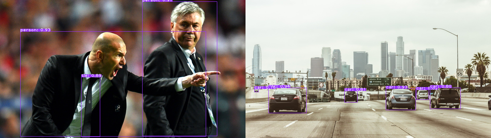
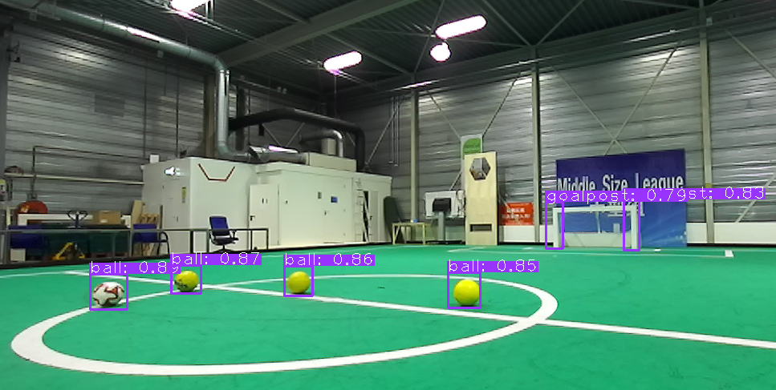

# YOLOv5-TensorRT


  
The goal of this library is to provide an accessible and robust method for performing efficient, real-time object detection with [YOLOv5](https://github.com/ultralytics/yolov5) using NVIDIA TensorRT. The library was developed with real-world deployment and robustness in mind. Moreover, the library is extensively documented and comes with various guided examples.

<div align="center">

[](https://github.com/noahmr/yolov5-tensorrt#install)
[](https://github.com/noahmr/yolov5-tensorrt#usage)
[](LICENSE)
</div>
  
## <div align="center">Features</div>

- C++ and Python API
- FP32 and FP16 inference
- Batch inference
- Support for varying input dimensions
- ONNX support
- CUDA-accelerated pre-processing
- Integration with OpenCV (with optionally also the OpenCV-CUDA module)
- Modular logging and error reporting
- Extensive documentation available on all classes, methods and functions


## <div align="center">Platforms</div>

<details open>
<summary>Platforms</summary>

- Modern Linux distros
- NVIDIA L4T (Jetson platform)
</details>
  
<details open>
<summary>Dependencies</summary>
 
- TensorRT >=8 (including libnvonnxparsers-dev)
- CUDA >= 10.2
- OpenCV  
- Pybind11 (optional, for Python API)
  
</details>


## <div align="center">Install</div>

<details>
<summary>Build/Install with Pip (for just Python)</summary>
  
Ensure that at least the TensorRT, CUDA and OpenCV dependencies mentioned above are installed on your system, the rest can be handled by Pip. You can install the library using:
```bash
pip3 install .
```
This will build and install the only the Python API, as well as the example scripts.
</details>
  
  
  
<details>
<summary>Build/Install with CMake (for C++ and Python)</summary>
  
Configure the build with CMake:

```bash
mkdir build
cd build
cmake .. -DBUILD_PYTHON=OFF
```
If wish to also build and install the Python API, you can instead set ```-DBUILD_PYTHON=ON```. Next, build and install using
```
make
sudo make install
```  
This will build and install all of the example applications, as well as a shared library <em>yolov5-tensorrt.so</em>.

</details>

 

## <div align="center">Usage</div>

<details>
<summary>Command-line Usage</summary>
  
The library also comes with various tools/demos. If your YOLOv5 model is stored as <em>yolov5.onnx</em>, you can build a TensorRT engine using:

  
```bash
build_engine --model yolov5.onnx --output yolov5.engine
```
The resulting engine will be stored to disk at <em>yolov5.engine</em>. See [build_engine](examples/builder) for more information.
  
After the engine has been stored, you can load it and detect objects as following:
```bash
process_image --engine yolov5.engine --input image.png --output result.png
```
A visualization of the result will be stored to disk at <em>result.png</em>. See [process_image](examples/image) for more information.
  
</details>

<details open>
<summary>C++ usage</summary>

Include ```yolov5_builder.hpp``` in your code. If your YOLOv5 model is stored as <em>yolov5.onnx</em>, you can build the TensorRT engine using three lines of C++ code:
  
```cpp
yolov5::Builder builder;
builder.init();
builder.build("yolov5.onnx", "yolov5.engine");
```

  
For detection, include ```yolov5_detector.hpp``` in your code. You can detect objects with the following code:
  
```cpp
yolov5::Detector detector;
detector.init();
detector.loadEngine("yolov5.engine");

cv::Mat image = cv::imread("image.png");

std::vector<yolov5::Detection> detections;
detector.detect(image, &detections);
```

</details>

<details>
<summary>Python usage</summary>

Import the ```yolov5tensorrt``` package in your code. If your YOLOv5 model is stored as <em>yolov5.onnx</em>, you can build the TensorRT engine using three lines of Python code:
  
```python
builder = yolov5tensorrt.Builder()
builder.init()
builder.build("yolov5.onnx", "yolov5.engine")
```

Next, you can detect objects using with the following code:
  
```python
detector = yolov5tensorrt.Detector()
detector.init()
detector.loadEngine("yolov5.engine")

image = cv2.imread("image.png")

r, detections = detector.detect(image)
```

</details>
  
  
<details>
<summary>Examples</summary>

Various **documented** examples can be found in the [examples](examples) directory.

In order to **build** a TensorRT engine based on an ONNX model, the following
tool/example is available:
- [build_engine](examples/builder) (C++/Python): build a TensorRT engine based on your ONNX model

For **object detection**, the following tools/examples are available:
- [process_image](examples/image) (C++/Python): detect objects in a single image
- [process_live](examples/live) (C++/Python): detect objects live in a video stream (e.g. webcam)
- [process_batch](examples/batch) (C++/Python): detect objects in multiple images (batch inference)
  
</details>

  
<details>
<summary>Importing the library in your project: CMake</summary>
  
After installing the library, you can include it in your CMake-based project through pkg-config using the following:
```
find_package(PkgConfig REQUIRED)
pkg_check_modules(YOLOV5_TENSORRT yolov5-tensorrt)
```
This will provide the usual ```YOLOV5_TENSORRT_INCLUDE_DIRS```, ```YOLOV5_TENSORRT_LIBRARIES``` and ```YOLOV5_TENSORRT_VERSION``` variables in CMake.
</details>


  
<details>
<summary>Importing the library in your project: pkg-config</summary>
  
After installing the library, in order to use the library in your own project, you can include and link it in the usual manner through [pkg-config](https://www.freedesktop.org/wiki/Software/pkg-config/). To get the include directories of the library, use:
  
```
pkg-config --cflags yolov5-tensorrt
```
and similarly for linking:

```
pkg-config --libs yolov5-tensorrt
```
</details>
  
<details open>
<summary>Additional Resources</summary>
  
- [Use with Stereolabs ZED](https://github.com/noahmr/zed-yolov5)
- [AI at RobotSports (Kaggle)](https://www.kaggle.com/charel/yolov5-1st-place-world-championships-robocup-2021)
</details>
  
  

## <div align="center">About</div>

This library is developed at [VDL RobotSports](https://robotsports.nl),
an industrial team based in the Netherlands participating in the RoboCup Middle
Size League, and currently sees active use on the soccer robots.

<details>
<summary>RobotSports Demo</summary>

  
  
</details>
  
<details>
<summary>Citing</summary>
  
If you like this library and would like to cite it, please use the following (LateX):

```tex
@misc{yolov5tensorrt,
  author       = {van der Meer, Noah and van Hoof, Charel},
  title        = {{yolov5-tensorrt}: Real-time object detection with {YOLOv5} and {TensorRT}},
  howpublished = {GitHub},
  year         = {2021},
  note         = {\url{https://github.com/noahmr/yolov5-tensorrt}}
}
```
</details>

  
## <div align="center">License</div>

Copyright (c) 2021, Noah van der Meer

This software is licenced under the MIT license, which can be found in [LICENCE.md](LICENCE.md). By using, distributing, or contributing to this project, you agree to the terms and conditions of this license.
